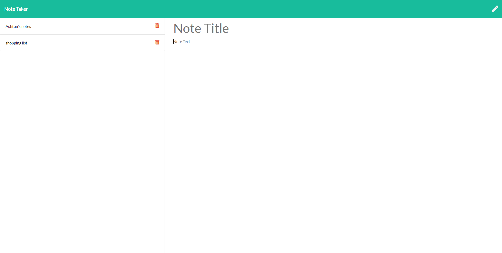

# Note Taker

  
[](https://opensource.org/licenses/none)
  
## Description
used to create and store notes
  
## Table of Contents
- [Installation](#installation)
- [Usage](#usage)
- [Contributing](#contributing)
- [Test](#test)
- [License](#license)
- [Questions](#questions)
  
## Installation
```md
run npm install
```
  
## Usage
```md
Press the new note button and add a title and body and push save.
```
  
## Screenshots

  
## Reporting
```md
my email or github
```
## License
[](https://opensource.org/licenses/none)

## Links 
https://note-ashton.herokuapp.com/notes
https://github.com/ashiemotto/note-taker  
## Questions 
Add an issue through GitHub:
 https://github.com/ashiemotto
  
Or using email:
Email: ashheadley@gmail.com

